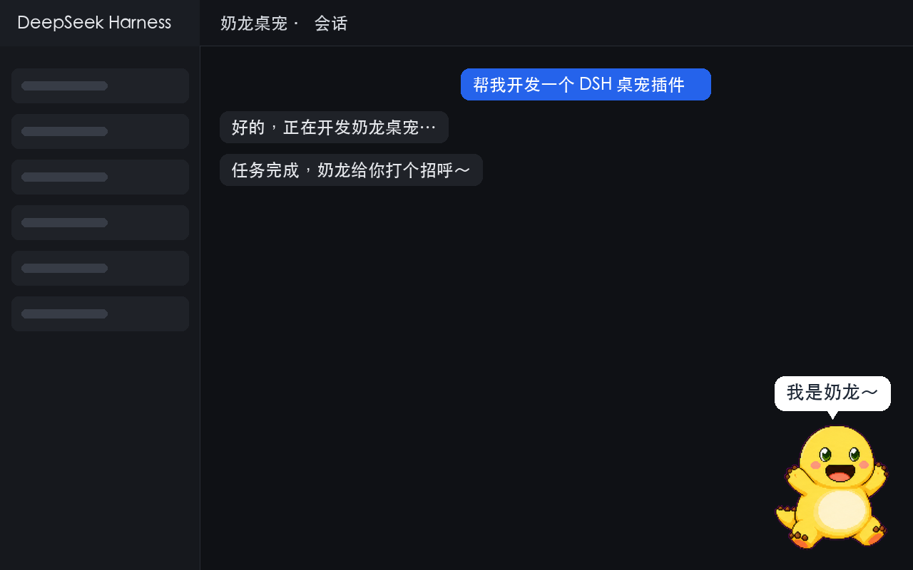
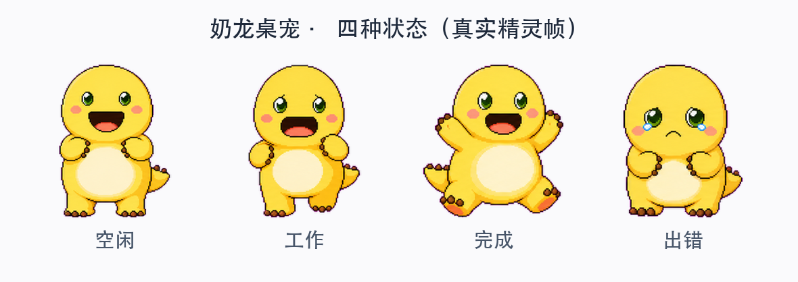

# dsh-nailong-pet 🐉

给 [DeepSeek Harness (DSH)](https://github.com/deepseek-ai) 的 Web 界面装一只会动的**奶龙桌宠**：它常驻在页面右下角，会根据 Agent 的实时工作状态切换动画，任务完成时还会蹦起来喊一句「我是奶龙～」。



---

## 目录

- [它能做什么](#它能做什么)
- [效果预览](#效果预览)
- [状态 → 动作映射](#状态--动作映射)
- [工作原理](#工作原理)
- [安装](#安装)
- [配置](#配置)
- [交互](#交互)
- [项目结构](#项目结构)
- [素材来源与版权](#素材来源与版权)
- [技术备忘：帧动画为什么不会闪](#技术备忘帧动画为什么不会闪)
- [常见问题](#常见问题)
- [License](#license)

---

## 它能做什么

- 常驻 **Web 界面右下角**（`shell.overlay` 等价位置），不遮挡对话内容。
- 依据 Agent 状态实时切换 9 组精灵动画中的相应动作。
- 任务完成（Agent 由 running → idle）时：**跳跃庆祝 + 气泡「我是奶龙～」+ 播放语音**。
- Agent 出错时显示难过表情 + 气泡「哎呀…出错了」。
- 可**拖动**摆位、**单击**打招呼（重放语音）、**静音**、**隐藏**（隐藏后留一个 🐉 按钮恢复）。

## 效果预览

**四种状态的真实精灵帧**（截取自 `sprite.webp`）：



**「工作中」动画循环演示**（GIF，取自精灵图第 7 行原地跑）：


## 状态 → 动作映射

| Agent 状态 | 触发条件 | 奶龙动作（精灵图行） |
| --- | --- | --- |
| `idle` | 无 Agent 运行 | 呼吸眨眼循环（row 0） |
| `running` | 任一 Agent 正在工作 | 原地跑 ↔ 思考检查交替（row 7 / row 8） |
| 完成 | Agent 由 running 转 idle | 跳跃庆祝 + 语音「我是奶龙～」（row 4） |
| 出错 | 捕获到 `agent/error` | 难过 + 「哎呀…出错了」（row 5） |
| 打招呼 | 用户单击桌宠 | 挥手 + 重放语音（row 3） |

> 状态切换由 Host 侧的 `agent/status` 事件驱动，浏览器端每 `pollMs` 轮询一次 `/nailong/state`（默认 600ms）。「完成」判定为：某个 Agent 从 `running` 变为 `idle` 且此时没有任何 Agent 仍在运行。

## 工作原理

这是一个**零构建步骤的静态 Host 插件**（与 `dsh-agent-teams` / `dsh-memory-evolve` 同构），全部逻辑收敛在单个 `index.js` 里，浏览器端是一段纯 DOM 脚本 `assets/pet.js`。它不需要 React 客户端打包、不需要 `dsh.client` 扫描，也不依赖动态插件运行时。

```
┌─────────────────────────────── Host（index.js）───────────────────────────────┐
│ 1. webServer.register('/nailong')  → 提供 sprite.webp / voice.mp3 / pet.js    │
│                                         以及 /nailong/state（JSON 状态）        │
│ 2. webServer.tapIndex()            → 在每个页面的 <head> 注入                  │
│                                         <script src="/nailong/pet.js" defer>  │
│ 3. ctx.on('agent/status')          → 维护状态机 { status, completionSeq,       │
│    ctx.on('agent/error')               errorSeq }（聚合所有 Agent）            │
└──────────────────────────────────────────────────────────────────────────────┘
                                    │
                                    ▼
┌──────────────────────────── Browser（assets/pet.js）─────────────────────────┐
│ · 纯 DOM 创建桌宠（fixed 右下角），注入 CSS                                   │
│ · CSS steps() 播放精灵图帧动画（宽度/行/帧数由 CSS 变量控制）                  │
│ · setInterval 每 600ms fetch /nailong/state → 切换动作 / 播放语音             │
│ · 指针事件实现拖动、单击、静音、隐藏                                           │
└──────────────────────────────────────────────────────────────────────────────┘
```

关键点：

- **状态聚合**：Host 插件挂在宿主根作用域，能收到所有 Agent 的 `agent/status` 事件；用 `Map<agentId, status>` 聚合，只要还有任一 Agent 在运行就显示「工作中」，全部空闲才算「完成」。
- **兜底读取**：若插件从未收到过 `agent/status` 事件（极端情况下），`/nailong/state` 会回退到直接读取 `ctx.agents.list()` 的实时 `status` 字段。
- **静态资源内存缓存**：`sprite.webp` / `voice.mp3` 在 `apply()` 时一次性读入内存，后续请求不再碰磁盘。

## 安装

本插件是**静态 Host 插件**（与 `dsh-agent-teams` / `dsh-memory-evolve` 同构）。安装分两步：

1. 把本包注册进目标 profile 的依赖（`dsh plugin add`，等价于在 profile 目录里 `pnpm add`）；
2. 在目标 profile 的 `cordis.patch.yml` 里挂一行，让它进入宿主组合。

装完**完全重启 DSH** 才生效。下面按「你如何启动 DSH」分情况给出命令。

### 0. 前置：找到你的 profile 目录

DSH 的 profile 位于 `$DSH_HOME/profiles/<name>`；`$DSH_HOME` 未设置时默认是 `~/.dsh`。Web 界面默认使用 `web` profile，即 `~/.dsh/profiles/web/`：

```text
~/.dsh/profiles/web/
├── package.json          # 依赖清单（dsh plugin add 会改这里）
├── cordis.patch.yml      # 你的补丁层（挂载插件的行写在这里）
├── cordis.yml            # bundle 层（不要改）
├── node_modules/         # 链接进来的插件
└── pnpm-lock.yaml
```

下文命令里的 `--profile web`，web 用户保持 `web` 即可；其余 profile 换成实际名字。

### 1. 把插件添加进 profile

> `dsh plugin` 只是把 `add <pkg>` 原样转发给 profile 目录里的 `pnpm`，因此下面 A/B/C 三条命令完全等价；没有 `dsh` CLI 时可直接用手动方式 D。

#### 情况 A：你用 `npx @deepseek-ai/dsh` 运行 DSH（最省事）

DSH 的 CLI 就随包分发，无需单独安装。直接用同一个 npx 包执行插件管理：

```sh
# 本地克隆/解压出来的目录（软链引用，改代码即时生效，适合开发）
npx @deepseek-ai/dsh plugin --profile web add link:/path/to/dsh-nailong-pet

# 或直接从 GitHub 仓库安装（发布/分享用）
npx @deepseek-ai/dsh plugin --profile web add github:yourname/dsh-nailong-pet
```

#### 情况 B：`dsh` 命令已在 PATH（全局安装）

```sh
dsh plugin --profile web add link:/path/to/dsh-nailong-pet
```

#### 情况 C：你在 DSH 源码 / 安装目录内

```sh
pnpm exec dsh plugin --profile web add link:/path/to/dsh-nailong-pet
```

#### 情况 D：手动（没有可用 CLI）

`dsh plugin add` 本质就是在 profile 目录里跑一次 `pnpm add`，所以手动也完全等价：

```sh
cd ~/.dsh/profiles/web
pnpm add link:/path/to/dsh-nailong-pet      # 本地目录
# pnpm add github:yourname/dsh-nailong-pet  # 或 GitHub 仓库
```

### 2. 挂载到宿主组合（写 patch 行）

只「添加依赖」还不会让插件跑起来——DSH 需要在组合里看到这一行。编辑
`~/.dsh/profiles/web/cordis.patch.yml`，在 `insert:` 列表里加入：

```yaml
- insert:
    - id: nailong-pet          # 必须等于 index.js 里导出的 name（"nailong-pet"）
      name: dsh-nailong-pet    # 包名（package.json 里的 name）
      config:
        routePrefix: /nailong  # 资源与状态接口的 URL 前缀（无尾斜杠）
        petWidth: 140          # 桌宠显示宽度（px）
        pollMs: 600            # 浏览器端轮询间隔（ms）
```

> `id` 对应 `index.js` 的 `export const name = "nailong-pet"`；`name` 是 npm 包名 `dsh-nailong-pet`。二者不要写反。

### 3. 重启 DSH 并验证

1. **完全退出** DSH（关掉 Host 进程，而不只是浏览器标签页）；
2. 重新启动（`npx @deepseek-ai/dsh web` 或你的原启动命令）；
3. **强制刷新**浏览器页面（Cmd+Shift+R / Ctrl+Shift+R）。

用三条请求验证是否挂载成功：

```sh
# 状态接口返回 JSON
curl http://127.0.0.1:3080/nailong/state
# 精灵图返回 image/webp
curl -I http://127.0.0.1:3080/nailong/sprite.webp
# 浏览器端脚本返回 application/javascript
curl -I http://127.0.0.1:3080/nailong/pet.js
```

三者 `Content-Type` 正确、页面右下角出现奶龙，即成功。也可看 DSH 启动日志里是否打印了 `nailong-pet: 桌宠已挂载…`。

### 卸载 / 更新

```sh
# 卸载：先完全退出 DSH，再移除依赖
npx @deepseek-ai/dsh plugin --profile web remove dsh-nailong-pet
# 然后删掉 cordis.patch.yml 里的 nailong-pet 行，重启 DSH

# 更新本地 link: 版：改完代码直接重启即可（软链即时生效）
# 更新 github: 版：重新 add 覆盖，再重启
npx @deepseek-ai/dsh plugin --profile web add github:yourname/dsh-nailong-pet
```

> DSH 可能保留一份历史设置记录，不会再生效、不占端口，属正常现象。

## 配置

| 键 | 类型 | 默认值 | 说明 |
| --- | --- | --- | --- |
| `routePrefix` | `string` | `"/nailong"` | 静态资源 + `/state` 接口的 URL 前缀，需与 `assets/pet.js` 的注入保持一致（Host 会自动把前缀替换进脚本）。 |
| `petWidth` | `number` | `140` | 桌宠显示宽度（px），高度按 192:208 原始帧比例自动计算。 |
| `pollMs` | `number` | `600` | 浏览器端轮询 Agent 状态的时间间隔（ms），越小越跟手、也越耗电。 |

> 若改了 `routePrefix`，无需手动改任何文件——Host 在服务 `pet.js` 时会自动把 `__ROUTE_PREFIX__` 占位符替换为你配置的前缀。

## 交互

| 操作 | 效果 |
| --- | --- |
| 按住拖动 | 移动桌宠位置（位置仅在当前页面会话内有效） |
| 单击 | 挥手打招呼 + 重放「我是奶龙～」 |
| 悬停 → 🔊 | 静音 / 恢复声音 |
| 悬停 → ✕ | 隐藏桌宠（右下角保留 🐉 按钮，点击恢复） |

## 项目结构

```
dsh-nailong-pet/
├── index.js                 # Host 插件（路由 + 状态机 + index 注入）
├── package.json             # npm 包描述（peerDependencies 指向 cordis/schemastery）
├── assets/
│   ├── sprite.webp          # 奶龙精灵图（1536×1872，9 行 × 8 帧，每帧 192×208）
│   ├── voice.mp3            # 「我是奶龙～」语音片段（约 1.3s）
│   └── pet.js               # 浏览器端脚本（纯 DOM，无构建）
├── screenshots/             # 效果截图（README 引用）
│   ├── pet-demo.png
│   ├── states.png
│   └── pet-run.gif
├── README.md
├── LICENSE
└── .gitignore
```

## 素材来源与版权

- **精灵图 `sprite.webp`**：来自开源项目 [petdex.dev 的 Nailong 奶龙条目](https://petdex.dev/pets/nai-long)（[crafter-station/petdex](https://github.com/crafter-station/petdex)，MIT License）。这是社区绘制的奶龙像素风格形象；「奶龙」角色本身及其衍生形象的知识产权归其原权利人所有，请勿用于商业用途。
- **语音 `voice.mp3`**：从一段「咿牛儿童故事」片头音频中截取出的「我是奶龙」台词（约 1.3 秒），经降噪与响度归一处理。该音频版权归其原制作方所有，仅供个人学习与演示使用。
- 其余代码以 MIT 协议发布（见 [LICENSE](LICENSE)）。

## 技术备忘：帧动画为什么不会闪

CSS 精灵动画常见的「向左滑动闪屏」bug，根因是**步数与位移量不对齐**：

- 精灵图每行固定 8 帧（8 × 192px），但不同动作的帧数不同（空闲 6 帧、挥手 4 帧、跳跃 5 帧……）。
- 如果 `animation-timing-function: steps(n)` 的 `n` 等于该动作帧数，而 `keyframes` 的位移终点却固定按整行 8 格走，那么每一步的落点就不再是帧宽（192px × scale）的整数倍，帧与帧之间就会出现「滑到半帧」的闪屏。

正确写法是让**位移终点 = 帧数 × 单帧宽度**：

```css
@keyframes nlg-play {
  from { background-position-x: 0px; }
  to   { background-position-x: calc(-1 * var(--nlg-frames) * 192px * var(--nlg-s)); }
}
```

这样 `steps(var(--nlg-frames))` 的每一步恰好跨过一帧，落点永远对齐格子。

## 常见问题

**Q：刷新页面后看不到桌宠？**
确认插件已挂载（`cordis.patch.yml` 的 `nailong-pet` 行），且 web 进程已重启；然后强制刷新（Cmd+Shift+R）。可在浏览器开发者工具里检查 `/nailong/state` 是否返回 JSON、`/nailong/pet.js` 是否 200。

**Q：任务完成后没有声音？**
浏览器会自动拦截无用户交互的自动播放。首次与页面交互（点击/输入）之后，`audio.play()` 才能出声；另外检查是否被右上角 🔊 静音。

**Q：桌宠显示为空白方块？**
多半是 `/nailong/sprite.webp` 未加载成功（路由未生效或前缀不匹配）。确认 `routePrefix` 配置与页面里的脚本 `src` 一致。

**Q：想换桌宠大小 / 位置 / 动作映射？**
大小改 `config.petWidth`；位置默认右下角，可在 `assets/pet.js` 顶部的 `pos` 与 CSS 中调整；动作映射在 `assets/pet.js` 的 `ANIMS` 与 `index.js` 的状态机里改。

## License

[MIT](LICENSE) —— 代码部分。精灵图与语音素材的版权见 [素材来源与版权](#素材来源与版权)。
